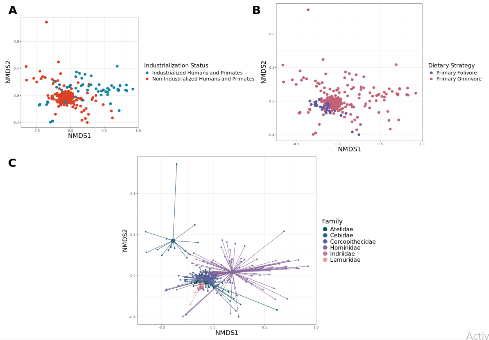
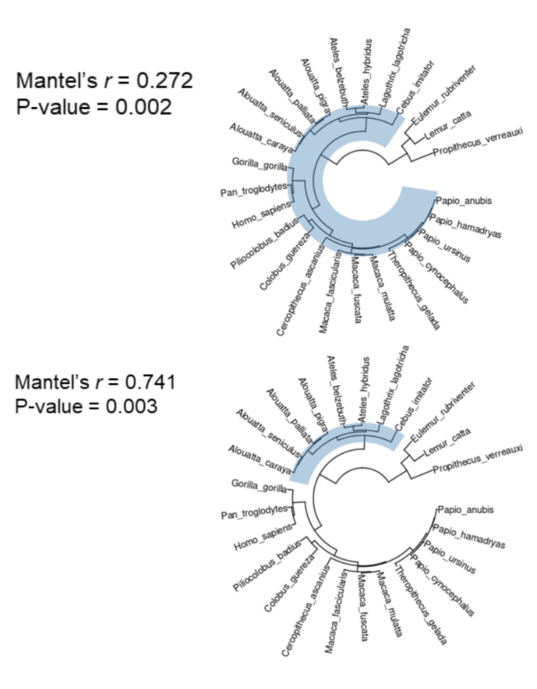
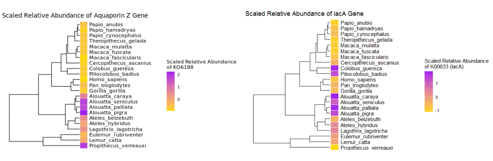
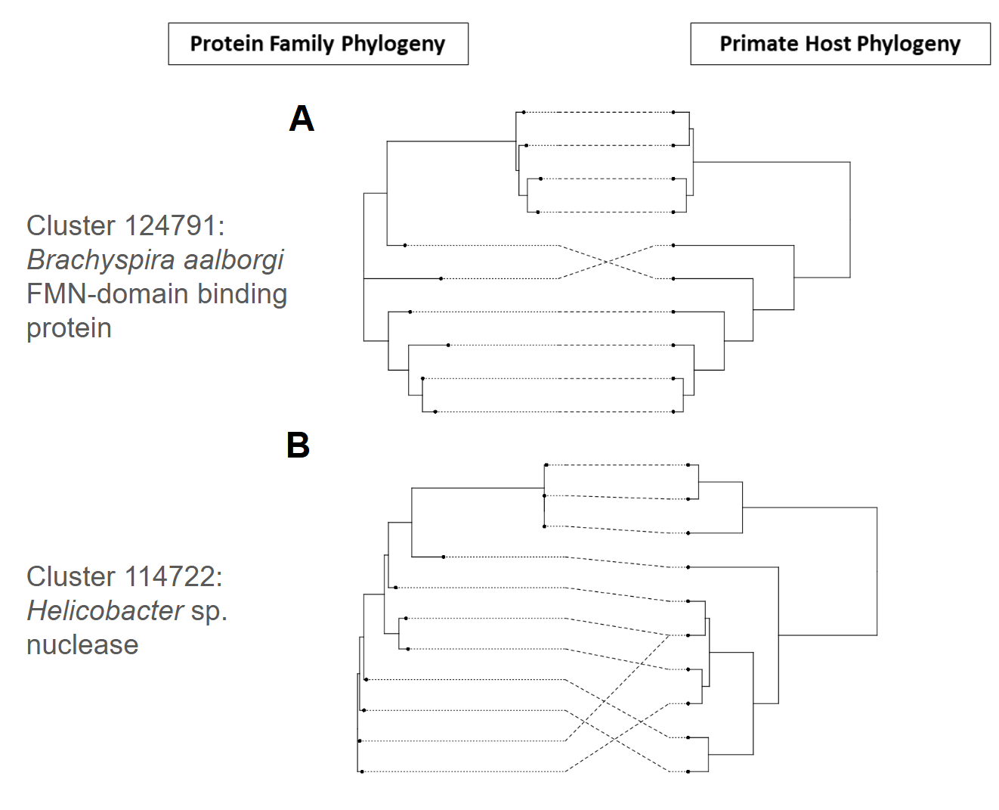
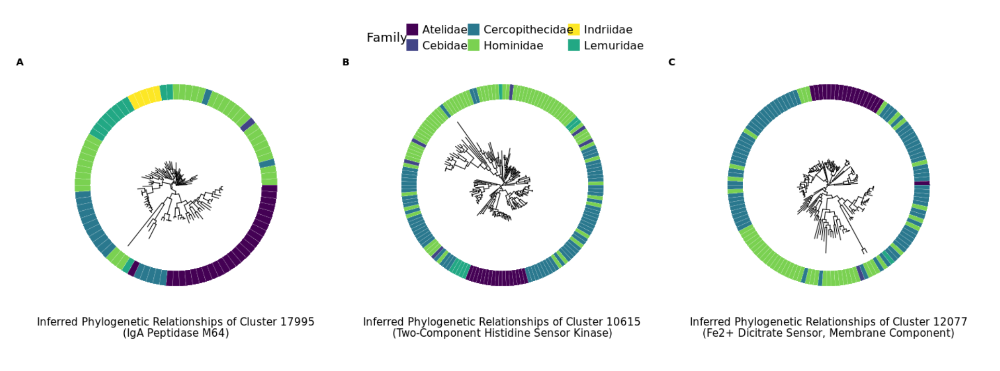
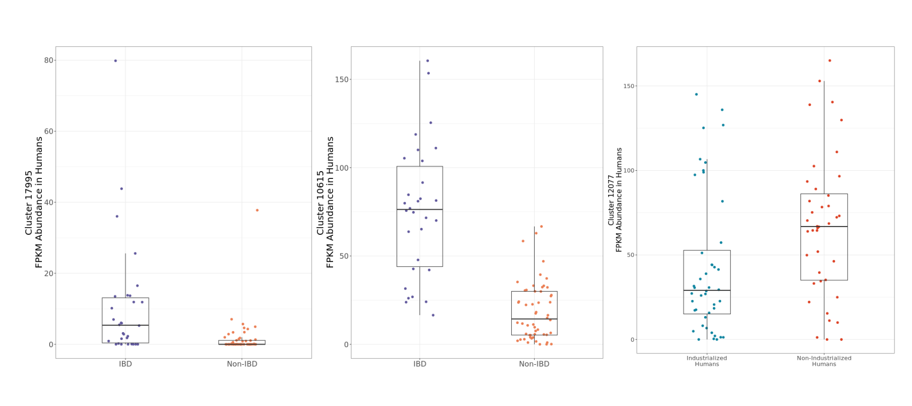

# Functional Metagenomic Meta-Analysis of Primate Gut Microbiomes

## Overview

This repository contains data and code for a comprehensive meta-analysis of functional metagenomic data from primate gut microbiomes. The study investigates how host evolutionary history connects to gut microbiome function and diversity. By leveraging functional metagenome annotation and clustering, phylogenetic analyses, and comparative metagenomics, the project illuminates key microbial functions that appear to have codiversified across primate hosts and highlights how the abundance of these phylogeny-linked traits vary across human subjects that live in industrialized environments and suffer from chronic disease.

## Key Insights

### Functional Composition and Industrialization

The functional composition of primate gut microbiomes shows significant associations with industrialization, dietary strategy, and host taxonomy. Ordination analyses reveal clustering of microbiomes by these factors, pointing to the significance of host taxonomy and microbial function.

*Figure 1: Functional composition of primate gut microbiomes associates with industrialization, dietary strategy, and host taxonomy.*

### Functional Phylosymbiosis

Functional phylosymbiosis is observed across primate taxa, where microbial functional traits mirror host evolutionary relationships. Examining the the correlation between primate phylogenetic history and the diversity of primate metagenomes  highlights the deep evolutionary ties between host taxa and their associated microbial metagenomes. Various primate clades manifest especially strong phylosymbiotic signal.

*Figure 2: Functional phylosymbiosis across primate clades.*

### Phylogenetic Signal in Microbial Functions

Gut microbial KEGG Orthology (KO) modules exhibit significant phylogenetic signal, reflecting host lineage-specific functional adaptations. Heatmaps of KO module abundance underscore these patterns, providing a basis for exploring co-evolutionary dynamics.

*Figure 3: Gut microbial KEGG Orthology (KO) modules manifest phylogenetic signal.*

### Co-Phylogenetic Patterns in Microbial Proteins

Protein family diversity within gut microbes parallels primate host phylogeny. Co-phylogenetic analyses of *Brachyspira aalborgi* and *Helicobacter sp.* protein families reveal tight evolutionary congruence with their primate hosts, suggesting long-term co-evolutionary processes.

*Figure 4: Co-phylogenetic plots of protein families and primate hosts.*

### Phylogenetic and Functional Divergences

Metagenome-derived microbial protein families display evidence of codiversification with the primate hosts they are derived from. These functions which are linked to primate phylogenetic history are differentially enriched among human subjects with IBD and those who live in industrialized environments.

*Figure 5A: Phylogenetic trees with heatmap rings of protein family distributions.*

*Figure 5B: Boxplots of functional divergences in human gut microbiomes.*

---

## Code Outline

The code used for the analysis is organized in the following order:

1.  `download_sra_data.py`: Downloads data from the Sequence Read Archive (SRA).
2.  `change_SRA_file_names.py`: Changes the names of the SRA files.
3.  `primate_data_to_IGC.py`:  Processes primate data to produce host-specific sets of metagenome-derived microbial gene content.
4.  `translate_fasta.py`: Translates nucleotide sequences to protein sequences.
5.  `cdhit_whole_directory.py` and `subset_genes_with_proteins.py`: Identifies a non-redundant set of sequences at a 95% threshold and retrieves the corresponding non-redundant set of genes.
6.  `meta_mapper.py` and `read_to_bam.py`: Maps quality-controlled reads against the set of non-redundant genes.
7.  `kegg_diamond_mapper.py`:  Maps non-redundant gene sequences to the KEGG database.
8.  `KO_count_table_merge_wrapper.py`: Merges the KEGG and gene catalog mappings.
9.  `merge_KO_files.py`: Merges all count tables from all host taxa to produce a comprehensive count table.
10. `analysis_HQ.Rmd`: Unifies analyses and figure generation into one script.
---
